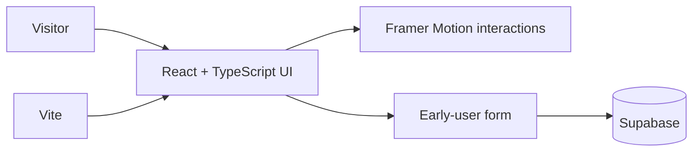

# ReturnPal product prototype

ReturnPal explores a simple idea: help people remember retail return deadlines before they lose the option to get their money back.

This repository contains the responsive product landing page and early-user validation flow. It is a prototype—not a production mobile application—and the validation section describes hypotheses to test rather than customer outcome claims.

## What is implemented

- Responsive React and TypeScript landing experience
- Product features and step-by-step workflow sections
- Honest product-validation goals for reminder, capture, and calendar concepts
- Supabase-backed early-user registration
- Download and interactive demo modals
- Keyboard navigation, reduced-motion support, and accessible UI primitives

## Architecture



## Run locally

Requirements: Node.js 18+ and a Supabase project.

```bash
npm install
cp .env.example .env
```

Add the public client credentials to `.env`:

```dotenv
VITE_SUPABASE_URL=your_supabase_project_url
VITE_SUPABASE_ANON_KEY=your_supabase_anon_key
```

Then start the development server:

```bash
npm run dev
```

## Quality checks

```bash
npm run build
npm run lint
```

## Current status

The repository is an early product and usability prototype. Before a production release, it still needs validated customer research, authenticated administration, monitoring, automated tests, and a documented deployment process.

## Tech stack

React · TypeScript · Vite · Tailwind CSS · Framer Motion · Supabase
